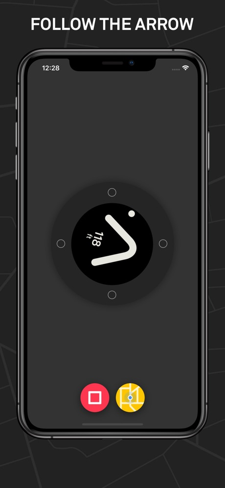

# Salman Afzal - iOS Developer

    
Software Engineer as an iOS Developer since <strong>more than 1.5yrs</strong>. Developed native iOS apps ranging from simple education apps to high-end secure enterprise apps. Always working towards clean code, intuitive user experience, data security. I am striving to keep me up with new technologies. 

<h2 id="skills">Skills</h2>

Currently using <strong>Swift</strong>, 1.5yrs, through all versions up to recent v5.0 
<strong>Xcode, Unit Tests, CoreData, CoreGraphics, CoreAnimation, Publish iOS app on appstore, Firebase</strong> 
<strong>Tools:</strong> GitHub, Bitbucker, Jira,Redmine, Trello, Skype 

  

<!-- # Hello!
*Thanks for stopping by*. This repo serves as a kind of ever-changing portfolio of projects I'm currently excited about; please feel free to look around. -->
## LINE Mobile
An app for managing your data or change a plan to be suitable for you. LINE Mobile is a brand new cellular network in Thailand that's just been announce for a few months here in Thailand. I was a part of the team who makes this app.

# WEBDOC
[WEBDOC](https://apps.apple.com/us/app/webdoc-be-healthy/id1394395909?ls=1) is a online Doctor's App. The basic requirements for the app were that it help address the health related problem by providing reliable online health platform which connects the Certified and Authorised Doctor’s to the Clients / Patients face to face on video / chat / audio calling.

I'm quite happy with the final product: WEBDOC was built entirely in Swift, with no external dependencies, and the UI—which was created using Auto Layout in Interface Builder—is attractive and animates smoothly. Most importantly, the code is clean, easy to reason about, and maintains strong separation of concerns.

<!-- &nbsp;&nbsp;&nbsp;&nbsp;&nbsp;&nbsp;&nbsp;&nbsp;&nbsp;&nbsp;&nbsp;&nbsp;&nbsp;&nbsp;&nbsp;&nbsp;&nbsp;&nbsp;&nbsp;&nbsp;   -->

&nbsp;&nbsp;&nbsp;&nbsp;&nbsp;&nbsp;&nbsp;&nbsp;&nbsp;&nbsp;&nbsp;&nbsp;&nbsp;&nbsp;&nbsp;&nbsp;

# Beeline bike navigation
[Beeline bike navigation](https://apps.apple.com/pk/app/beeline-bike-navigation/id1095384281) is companion app by Beeline for Beeline Moto and Beeline Velo: the motorcycle and cycling computers with better navigation. Better riding starts here
PLAN AND TRACK YOUR RIDE
Plan your route with our route planner with integrated Google search.

I'm quite happy with the final product:  Beeline bike navigation was built entirely in Swift, google maps API and the UI—which was created using Auto Layout in Interface Builder—is attractive and animates smoothly. Most importantly, the code is clean, easy to reason about, and maintains strong separation of concerns.

&nbsp;&nbsp;&nbsp;&nbsp;&nbsp;&nbsp;&nbsp;&nbsp;&nbsp;&nbsp;&nbsp;&nbsp;&nbsp;&nbsp;&nbsp;&nbsp;

 
# Taurus Trading
[Taurus Trading](https://apps.apple.com/us/app/taurus-trading/id1383579184?ls=1) is an International LTD App is a time saving app allowing the capture of all the container data at time of loading and submitting all the required information in easy simple steps and then submitted to Taurus Trading International LTD at a click. No more compiling of important data after the container has left leaving you to concentrate on other important tasks worry free.

&nbsp;&nbsp;&nbsp;&nbsp;&nbsp;&nbsp;&nbsp;&nbsp;&nbsp;&nbsp;&nbsp;&nbsp;&nbsp;&nbsp;&nbsp;&nbsp;

# Contact Info:

- Email: salmanafzal0900@gmail.com
- LinkedIn: [Salman Afzal](https://www.linkedin.com/in/salman-afzal-518a87141)
- Github: [@salmanafzal25](https://github.com/salmanafzal25/iOS-Portfolio.git)
- Stackoverflow: [@salmanafzal25](https://stackoverflow.com/users/12090600/salmanafzal0900)
- Whatsapp: +923125236323
