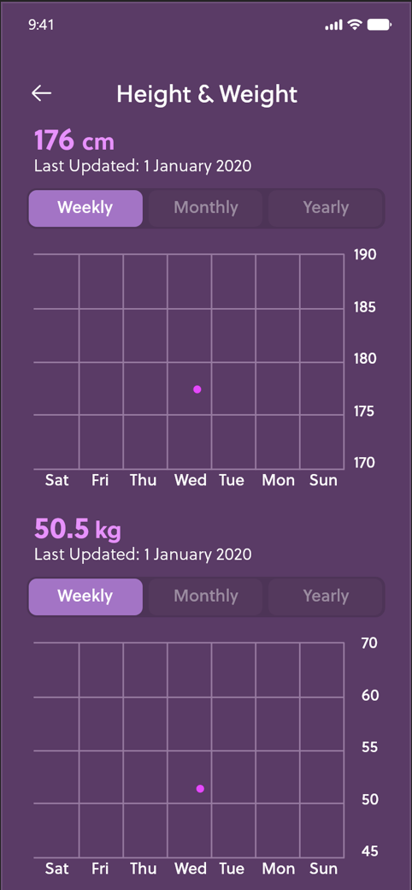
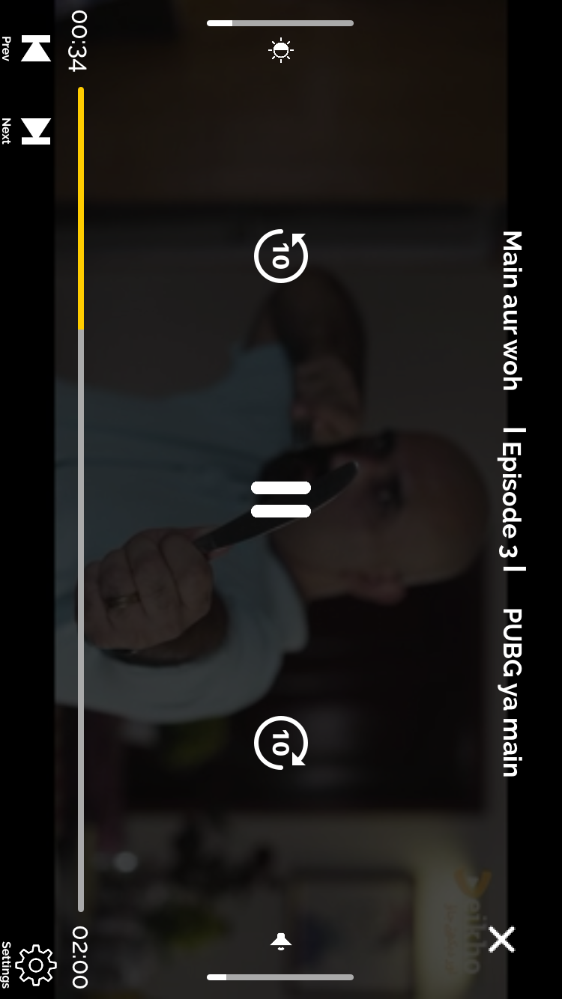
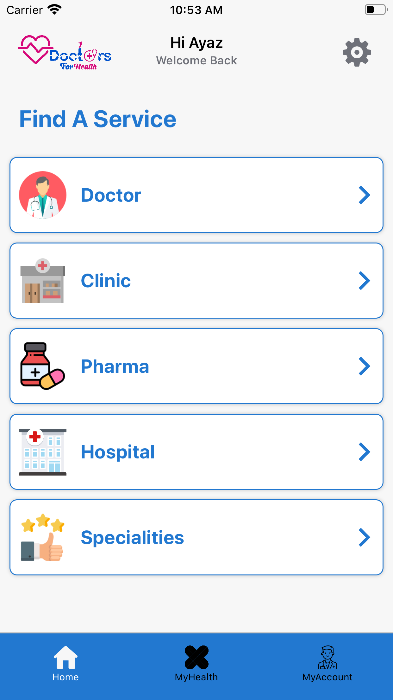
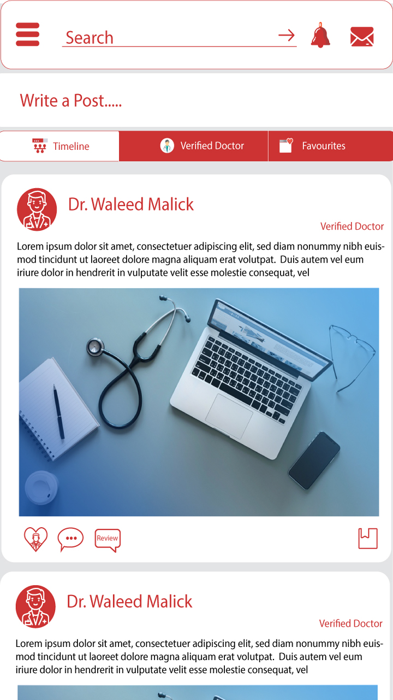

# Salman Afzal - iOS Developer

    
Software Engineer as an iOS Developer since <strong>more than 1.5yrs</strong>. Developed native iOS apps ranging from simple education apps to high-end secure enterprise apps. Always working towards clean code, intuitive user experience, data security. I am striving to keep me up with new technologies. 

<h2 id="skills">Skills</h2>

Currently using <strong>Swift</strong>, 1.5yrs, through all versions up to recent v5.0 
<strong>REST, GraphQL(Apollo), Firebase, Unit Tests, CoreData, CoreGraphics, CoreAnimation,Amazon S3 Bucket, Google Maps, Map box, Map Kit, One signal, Agora, Sinch, AVFoundation, Accessibility, Apple Account Creation And Maintenance  Publish iOS app on appstore</strong> 
<strong>Tools:</strong> GitHub, Bitbucker, Jira,Redmine, Trello, Skype 

  

  
  # Hello Doctor (Digital Healthcare Service)
[HelloDoctor](https://apps.apple.com/us/app/hello-doctor-patient/id1502356693?ls=1) is a online Doctor's App. The basic requirements for the app were that it help address the health related problem by providing reliable online health platform which connects the Certified and Authorised Doctor’s to the Clients / Patients face to face on video / chat / audio calling.

I'm quite happy with the final product: HelloDoctor was built entirely in Swift, with no external dependencies, and the UI—which was created using Auto Layout in Interface Builder—is attractive and animates smoothly. Most importantly, the code is clean, easy to reason about, and maintains strong separation of concerns.

<!-- &nbsp;&nbsp;&nbsp;&nbsp;&nbsp;&nbsp;&nbsp;&nbsp;&nbsp;&nbsp;&nbsp;&nbsp;&nbsp;&nbsp;&nbsp;&nbsp;&nbsp;&nbsp;&nbsp;&nbsp;   -->

&nbsp;&nbsp;&nbsp;&nbsp;&nbsp;&nbsp;&nbsp;&nbsp;&nbsp;&nbsp;&nbsp;&nbsp;&nbsp;&nbsp;&nbsp;&nbsp;

  # UAE-Barq (fitness app)
[UAE-BARQ](https://apps.apple.com/us/app/hello-doctor-patient/id1502356693?ls=123) is a Fitness App. in this app animation is used to demonstrate different exercises.

&nbsp;&nbsp;&nbsp;&nbsp;&nbsp;&nbsp;&nbsp;&nbsp;&nbsp;&nbsp;&nbsp;&nbsp;&nbsp;&nbsp;&nbsp;&nbsp;

  
  
    # TH-Auction (fitness app)
[TH-Auction](https://apps.apple.com/us/app/hello-doctor-patient/id1502356693?ls=123) is a Online Auction App.

&nbsp;&nbsp;&nbsp;&nbsp;&nbsp;&nbsp;&nbsp;&nbsp;&nbsp;&nbsp;&nbsp;&nbsp;&nbsp;&nbsp;&nbsp;&nbsp;

  
  
      # TH-Auction (fitness app)
[Alazba](https://apps.apple.com/us/app/hello-doctor-patient/id1502356693?ls=123) is a Online Animal Auction App.

&nbsp;&nbsp;&nbsp;&nbsp;&nbsp;&nbsp;&nbsp;&nbsp;&nbsp;&nbsp;&nbsp;&nbsp;&nbsp;&nbsp;&nbsp;&nbsp;

      # TH-Auction (fitness app)
[Goom Shoping](https://apps.apple.com/us/app/hello-doctor-patient/id1502356693?ls=123) is a Online Shoping App.

&nbsp;&nbsp;&nbsp;&nbsp;&nbsp;&nbsp;&nbsp;&nbsp;&nbsp;&nbsp;&nbsp;&nbsp;&nbsp;&nbsp;&nbsp;&nbsp;

  
        # TH-Auction (fitness app)
[PC Hotel](https://apps.apple.com/us/app/hello-doctor-patient/id1502356693?ls=123) is a Online Rooms reservation and food delivery App.

&nbsp;&nbsp;&nbsp;&nbsp;&nbsp;&nbsp;&nbsp;&nbsp;&nbsp;&nbsp;&nbsp;&nbsp;&nbsp;&nbsp;&nbsp;&nbsp;

  
  
  
          # TH-Auction (fitness app)
[Roomph](https://apps.apple.com/us/app/hello-doctor-patient/id1502356693?ls=123) is a Online Hotel reservation App.

&nbsp;&nbsp;&nbsp;&nbsp;&nbsp;&nbsp;&nbsp;&nbsp;&nbsp;&nbsp;&nbsp;&nbsp;&nbsp;&nbsp;&nbsp;&nbsp;

  
  
            # TH-Auction (fitness app)
[JOJO](https://apps.apple.com/us/app/hello-doctor-patient/id1502356693?ls=123) is a Online Money Transfer App.

&nbsp;&nbsp;&nbsp;&nbsp;&nbsp;&nbsp;&nbsp;&nbsp;&nbsp;&nbsp;&nbsp;&nbsp;&nbsp;&nbsp;&nbsp;&nbsp;

  
  
  
              # TH-Auction (fitness app)
[Cloud Mining](https://apps.apple.com/us/app/hello-doctor-patient/id1502356693?ls=123) is a Online Money Transfer App.

&nbsp;&nbsp;&nbsp;&nbsp;&nbsp;&nbsp;&nbsp;&nbsp;&nbsp;&nbsp;&nbsp;&nbsp;&nbsp;&nbsp;&nbsp;&nbsp;

  
  # ROVR (Mobilizing Physicians)
[ROVR](https://www.rovrmed.com)is the first step in giving physicians back their autonomy is to give back access to their data. We are a physician-led team that want to enable physicians to gain back access and control of their data and time.

Our current system in data-sharing is inefficient and most physicians don’t have a secure application to store their own personal data. The first application of Rovr can be applied to our current system of physician verification, documentation/credentialing, recruitment and scheduling. It takes on average 90 days to on-board a physician to an area he is needed. We offer physicians to instantly self-verify themselves on Rovr -Physicians Hiring App- and store all their secure and most needed data on their profiles for exchange to healthcare facilities

<b>Under Testing </b>
<!-- &nbsp;&nbsp;&nbsp;&nbsp;&nbsp;&nbsp;&nbsp;&nbsp;&nbsp;&nbsp;&nbsp;&nbsp;&nbsp;&nbsp;&nbsp;&nbsp;&nbsp;&nbsp;&nbsp;&nbsp;   -->

&nbsp;&nbsp;&nbsp;&nbsp;&nbsp;&nbsp;&nbsp;&nbsp;&nbsp;&nbsp;&nbsp;&nbsp;&nbsp;&nbsp;&nbsp;&nbsp;

  

  

# WEBDOC
[WEBDOC](https://apps.apple.com/us/app/webdoc-be-healthy/id1394395909?ls=1) is a online Doctor's App. The basic requirements for the app were that it help address the health related problem by providing reliable online health platform which connects the Certified and Authorised Doctor’s to the Clients / Patients face to face on video / chat / audio calling.

I'm quite happy with the final product: WEBDOC was built entirely in Swift, with no external dependencies, and the UI—which was created using Auto Layout in Interface Builder—is attractive and animates smoothly. Most importantly, the code is clean, easy to reason about, and maintains strong separation of concerns.

<!-- &nbsp;&nbsp;&nbsp;&nbsp;&nbsp;&nbsp;&nbsp;&nbsp;&nbsp;&nbsp;&nbsp;&nbsp;&nbsp;&nbsp;&nbsp;&nbsp;&nbsp;&nbsp;&nbsp;&nbsp;   -->

&nbsp;&nbsp;&nbsp;&nbsp;&nbsp;&nbsp;&nbsp;&nbsp;&nbsp;&nbsp;&nbsp;&nbsp;&nbsp;&nbsp;&nbsp;&nbsp;

# Al-Ghoneim E-Commerce store
[Al-Ghoneim](https://apps.apple.com/us/app/tawseel-al-ghoneim/id1508604549?ls=1) App to deliver Food, Grocery, Bakery & Cafe, Medicine, Gifts, Flowers and more. Launched from KSA from your favorite outlets and stores from anywhere within your city.delivered to your doorstep.

&nbsp;&nbsp;&nbsp;&nbsp;&nbsp;&nbsp;&nbsp;&nbsp;&nbsp;&nbsp;&nbsp;&nbsp;&nbsp;&nbsp;&nbsp;&nbsp;

# Med Store
[Med Store](https://apps.apple.com/us/app/id1520254548) App to deliver Medicine. Launched from Pakistan from your favorite outlets and stores from anywhere within your city.delivered to your doorstep.

&nbsp;&nbsp;&nbsp;&nbsp;&nbsp;&nbsp;&nbsp;&nbsp;&nbsp;&nbsp;&nbsp;&nbsp;&nbsp;&nbsp;&nbsp;&nbsp;

<b>Under Testing </b>

# Roomph
[Roomph]Roomph! Is Pakistan’s largest and fastest-growing hotel company focused on the budget hotel sector. We value what is most important to our customers and select only the best rooms and properties based on location, value, and cleanliness. With Roomph you can count on quality, consistency, and bargain prices… with strong Wi-Fi and AC every time!.

&nbsp;&nbsp;&nbsp;&nbsp;&nbsp;&nbsp;&nbsp;&nbsp;&nbsp;&nbsp;&nbsp;&nbsp;&nbsp;&nbsp;&nbsp;&nbsp;

<b>Under Testing </b>

# Let It Go (eXchange App like OLX)
[Let It Go](https://) Join one of the biggest online marketplace apps! Install our selling and shopping app to start trading up secondhand items in the mobile marketplace!.

&nbsp;&nbsp;&nbsp;&nbsp;&nbsp;&nbsp;&nbsp;&nbsp;&nbsp;&nbsp;&nbsp;&nbsp;&nbsp;&nbsp;&nbsp;&nbsp;

<b>Under Testing </b>

# Here At My Local
[Here At My Local](https://apps.apple.com/us/app/id1527280461)An app to help local independent businesses, advertise, sell and reward customer loyalty.

&nbsp;&nbsp;&nbsp;&nbsp;&nbsp;&nbsp;&nbsp;&nbsp;&nbsp;&nbsp;&nbsp;&nbsp;&nbsp;&nbsp;&nbsp;&nbsp;

# Mobile NewsPaper App
[Mobile Akhbar]() App app will provide users to read online newspaper.

&nbsp;&nbsp;&nbsp;&nbsp;&nbsp;&nbsp;&nbsp;&nbsp;&nbsp;&nbsp;&nbsp;&nbsp;&nbsp;&nbsp;&nbsp;&nbsp;

# Fowrry - Food Delivery and Online Shopping
[Fowrry](https://apps.apple.com/pk/app/fowrry/id1456256168) App to deliver Food, Grocery, Bakery & Cafe, Medicine, Gifts, Flowers and more...Launched from Islamabad… from your favorite Local and International restaurants, outlets and stores...from anywhere within your city...delivered to your doorstep...Order in just 4 easy steps
<b>Under Developement </b>

&nbsp;&nbsp;&nbsp;&nbsp;&nbsp;&nbsp;&nbsp;&nbsp;&nbsp;&nbsp;&nbsp;&nbsp;&nbsp;&nbsp;&nbsp;&nbsp;

# Flix - Video on demand servic App
[Flix]() App is a Video on demand servic App where you can see video online on ios device <b>Under Developement </b>

&nbsp;&nbsp;&nbsp;&nbsp;&nbsp;&nbsp;&nbsp;&nbsp;&nbsp;&nbsp;&nbsp;&nbsp;&nbsp;&nbsp;&nbsp;&nbsp;

<b>Under Developement </b>

# Deikho - Video on demand servic App
[Deikho]() App is a Video on demand servic App where you can see video online on ios device <b>Under Developement </b>

&nbsp;&nbsp;&nbsp;&nbsp;&nbsp;&nbsp;&nbsp;&nbsp;&nbsp;&nbsp;&nbsp;&nbsp;&nbsp;&nbsp;&nbsp;&nbsp;

<b>Under Testing</b>

# Goonj TV - Video on demand servic App
[Goonj TV]() App is a Video on demand servic App where you can see video online on ios device <b>Under Developement </b>

&nbsp;&nbsp;&nbsp;&nbsp;&nbsp;&nbsp;&nbsp;&nbsp;&nbsp;&nbsp;&nbsp;&nbsp;&nbsp;&nbsp;&nbsp;&nbsp;

<b>Under Testing</b>

  # IPSEN (Career Development App)
[Ipsen](https://www.ipsen.com) is a global specialty-driven biopharmaceutical group committed to discovering new solutions for targeted debilitating diseases and improving quality of life for patients.This XMapp application is intended to be a tool used to explore potential development opportunities for you to express an interest  and enable you to have discussions with your manager as you chart your career at Ipsen. This includes understanding the knowledge, skills, characteristics, and experiences that may be required for you to progress in your career.

&nbsp;&nbsp;&nbsp;&nbsp;&nbsp;&nbsp;&nbsp;&nbsp;&nbsp;&nbsp;&nbsp;&nbsp;&nbsp;&nbsp;&nbsp;&nbsp;

  # Hire Well (Recruiting App)
[Hirewell](https://hirewell.com)is a Chicago-based recruiting and staffing firm with specialized teams dedicated to technology, digital marketing, creative, human resources, and sales.

&nbsp;&nbsp;&nbsp;&nbsp;&nbsp;&nbsp;&nbsp;&nbsp;&nbsp;&nbsp;&nbsp;&nbsp;&nbsp;&nbsp;&nbsp;&nbsp;

# Doctors For Helath
Doctors For Helath is a online Doctor's App. The basic requirements for the app were that it help address the health related problem by providing reliable online health platform which connects the Certified and Authorised Doctor’s to the Clients / Patients face to face on video / chat / audio calling.

<!-- &nbsp;&nbsp;&nbsp;&nbsp;&nbsp;&nbsp;&nbsp;&nbsp;&nbsp;&nbsp;&nbsp;&nbsp;&nbsp;&nbsp;&nbsp;&nbsp;&nbsp;&nbsp;&nbsp;&nbsp;   -->

&nbsp;&nbsp;&nbsp;&nbsp;&nbsp;&nbsp;&nbsp;&nbsp;&nbsp;&nbsp;&nbsp;&nbsp;&nbsp;&nbsp;&nbsp;&nbsp;

  # Peoply (SecialMedia App)
[Peoply](https://webdoc.com)is social media apps that are the bare minimum for any social media marketer. They represent the biggest social platforms out there right now

&nbsp;&nbsp;&nbsp;&nbsp;&nbsp;&nbsp;&nbsp;&nbsp;&nbsp;&nbsp;&nbsp;&nbsp;&nbsp;&nbsp;&nbsp;&nbsp;

# Beeline bike navigation
[Beeline bike navigation](https://apps.apple.com/pk/app/beeline-bike-navigation/id1095384281) is companion app by Beeline for Beeline Moto and Beeline Velo: the motorcycle and cycling computers with better navigation. Better riding starts here
PLAN AND TRACK YOUR RIDE
Plan your route with our route planner with integrated Google search.

I'm quite happy with the final product:  Beeline bike navigation was built entirely in Swift, google maps API and the UI—which was created using Auto Layout in Interface Builder—is attractive and animates smoothly. Most importantly, the code is clean, easy to reason about, and maintains strong separation of concerns.

&nbsp;&nbsp;&nbsp;&nbsp;&nbsp;&nbsp;&nbsp;&nbsp;&nbsp;&nbsp;&nbsp;&nbsp;&nbsp;&nbsp;&nbsp;&nbsp;

# Recordio Voice Note Recorder
 [Recordio Voice Note Recorder](https://appstores.co/app/1449571837/recordio-voice-note-recorder) is an audio recorder, recorder for lectures, memos, meetings and more. Best recorder for voice recording with high quality voice recorder application is simple and easy to use. Organize and edit recordings on your phone. Share via email.

&nbsp;&nbsp;&nbsp;&nbsp;&nbsp;&nbsp;&nbsp;&nbsp;&nbsp;&nbsp;&nbsp;&nbsp;&nbsp;&nbsp;&nbsp;&nbsp;

 
 # Brand Mania
 [Brand Mania]() is an entertaining game where you guess the logos of popular companies. Advance through levels of difficulty and strive for the highest score possible. The more logos you guess the more coins you will earn. If you get stuck and don't know an answer, don't give up! use the coins you gathered to get hints or remove unnecessary letters.

&nbsp;&nbsp;&nbsp;&nbsp;&nbsp;&nbsp;&nbsp;&nbsp;&nbsp;&nbsp;&nbsp;&nbsp;&nbsp;&nbsp;&nbsp;&nbsp;

 
  # 4 Pics 1 Word 
 [4 Pics 1 Word ](https://appstores.co/app/1449565551/4-pics-1-word-trivia-game) is a word guessing game. It presents you with four pictures and then tasks you with guessing what specific word fits with the theme of the photos presented. It's a simple game that really seems to be clicking with people if the App Store charts are any indication. It's an interesting game.

&nbsp;&nbsp;&nbsp;&nbsp;&nbsp;&nbsp;&nbsp;&nbsp;&nbsp;&nbsp;&nbsp;&nbsp;&nbsp;&nbsp;&nbsp;&nbsp;

 
 
 
   # Quiz Me 
 [Quiz Me](https://appstores.co/app/1446563839/quiz-me-general-knowledge) makes you to become a Trivia Expert in Mathematics, IQ , General Knowledge, Science, Biology.Lets find a great quiz to test your brain.TRAIN YOUR BRAIN by answering these smart questions. 
Who says trivia isn't useful? You will keep your brain sharp with Quiz Me. We have hundreds of challenging trivia questions for you!

&nbsp;&nbsp;&nbsp;&nbsp;&nbsp;&nbsp;&nbsp;&nbsp;&nbsp;&nbsp;&nbsp;&nbsp;&nbsp;&nbsp;&nbsp;&nbsp;

 
   # QBScanner 
 [QBScanner](https://github.com/salmanafzal25/iOS-Portfolio/blob/master/README.md) is use to scan a QR code or barcode simply open the app, point the camera at the code, and you’re done!

&nbsp;&nbsp;&nbsp;&nbsp;&nbsp;&nbsp;&nbsp;&nbsp;&nbsp;&nbsp;&nbsp;&nbsp;&nbsp;&nbsp;&nbsp;&nbsp;

 
   # Football Clubs Logo Quiz 
 [Football Clubs Logo Quiz](https://appstores.co/app/1116512919/football-clubs-logo-quiz) is a Guess the Football Club logo quiz for fun! No matter you are a football fan or not, you must know some football club logos since it's the most inspirational sport in the world! Now quiz it,football logo quiz, for fun!.

&nbsp;&nbsp;&nbsp;&nbsp;&nbsp;&nbsp;&nbsp;&nbsp;&nbsp;&nbsp;&nbsp;&nbsp;&nbsp;&nbsp;&nbsp;&nbsp;

 
 
 
# Taurus Trading
[Taurus Trading](https://apps.apple.com/us/app/taurus-trading/id1383579184?ls=1) is an International LTD App is a time saving app allowing the capture of all the container data at time of loading and submitting all the required information in easy simple steps and then submitted to Taurus Trading International LTD at a click. No more compiling of important data after the container has left leaving you to concentrate on other important tasks worry free.

&nbsp;&nbsp;&nbsp;&nbsp;&nbsp;&nbsp;&nbsp;&nbsp;&nbsp;&nbsp;&nbsp;&nbsp;&nbsp;&nbsp;&nbsp;&nbsp;

# Contact Info:

- Email: salmanafzal0900@gmail.com
- LinkedIn: [Salman Afzal](https://www.linkedin.com/in/salman-afzal-518a87141)
- Github: [@salmanafzal25](https://github.com/salmanafzal25/iOS-Portfolio.git)
- Stackoverflow: [@salmanafzal25](https://stackoverflow.com/users/12090600/salmanafzal0900)
- Whatsapp: +923125236323
